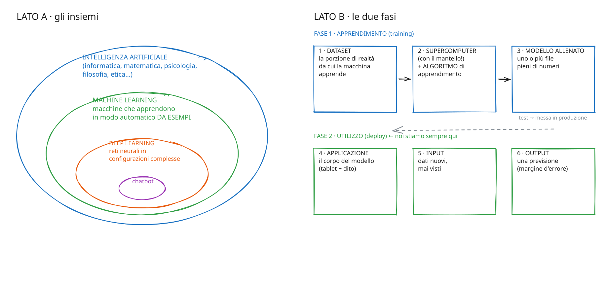

# Report di manutenzione

Questo è il documento che uso per tenere vivo il repo: cosa va corretto, cosa va riverificato, e quando. Le scadenze dipendono dalla stabilità del contenuto, quindi l'aggiornamento non dipende da quando mi ricordo.

## 1. Il ritmo

| Stabilità | Quando riverificare | Cosa fare |
|---|---|---|
| **volatile** | Prima di ogni edizione di un corso, e comunque ogni 60 giorni | Provare ogni strumento, ogni link, ogni esperimento. Aggiornare `verificato_il` |
| **evolutivo** | Ogni 6 mesi | Rileggere: il concetto regge ancora? Gli esempi funzionano? Aggiungere una voce in [evoluzione](evoluzione.md) se qualcosa è cambiato |
| **stabile** | Ogni anno | Rilettura editoriale; aggiornare fonti e citazioni |

Lo script [`scripts/check_freshness.py`](https://github.com/monaripietro/ai-literacy-101/blob/main/scripts/check_freshness.py) legge le intestazioni dei file e segnala quelli scaduti:

```bash
python3 scripts/check_freshness.py
```

## 2. Verifica dei contenuti

Ogni affermazione di fatto presente nei moduli deve avere una fonte, oppure essere marcata come osservazione d'aula con la data. Il registro delle verifiche e delle correzioni è tenuto fuori dal repository.

## 3. Esperimenti da rifare prima di ogni edizione

| Esperimento | Modulo | Esito atteso (2026) | Ultima prova | Esito |
|---|---|---|---|---|
| Conteggio sillabe negli haiku generati | M01 | Spesso sbagliato in italiano | 2026-06 | |
| "Riassumi l'articolo 189 della Costituzione" (modello senza ricerca web) | M06 | Risposta inventata e credibile | 2026-06 | |
| "Tre video YouTube per imparare l'ukulele" | M06 | Link verosimili e inesistenti | 2026-06 | |
| "Qual è il tuo knowledge cutoff?" a più persone | M06 | Date diverse | 2026-06 | |
| Tokenizzatore: parola ripetuta, italiano vs inglese | M05 | ID diversi con spazi; più token in italiano | 2026-06 | |
| Autolavaggio con e senza ragionamento | M08 | Risposte variabili | 2026-06 | |
| Carrello con persone "morte" | M08 | Il modello spesso non se ne accorge | 2026-06 | |
| Code interpreter su file Excel di esempio | M07 | Codice visibile, calcoli coerenti tra partecipanti | 2026-06 | |
| Test inverso sugli allegati ("seconda parola di pagina 5") | M07 | Rivela se il documento è intero o riassunto | 2026-06 | |

## 4. Strumenti e link volatili

| Strumento (categoria) | Usato in | Cosa controllare |
|---|---|---|
| Chat gratuita senza account con modelli piccoli (2026: duck.ai) | M06 | Disponibilità, modelli senza ricerca web |
| Demo pubblica di tokenizzatore (2026: quella di OpenAI) | M05 | Che funzioni, che mostri gli ID |
| Chat che mostrano il ragionamento in chiaro (2026: DeepSeek, Mistral Le Chat) | M08 | Che il ragionamento sia ancora visibile |
| Canvas (ChatGPT, Gemini, Le Chat; in Claude con altro nome) | M07 | Nome, disponibilità nel piano gratuito, anteprima del codice |
| Deep research (2026: Gemini) | M07 | Limiti del piano gratuito, verifica età dell'account |
| Ricerca accademica con AI (2026: Consensus) | M07 | Piano gratuito |
| Arena di valutazione basata sui voti (2026: LMArena) | M08 | Indirizzo (cambiato nel 2026), categorie |
| Benchmark strutturati (2026: Artificial Analysis) | M08 | Metriche disponibili |
| Ricerca con AI integrata nel motore di ricerca (2026: Google AI Mode) | M07 | Disponibilità in Italia |
| Chat locali (2026: LM Studio, GPT4All, Msty) | M08 | Requisiti hardware |
| [Web app finestra di contesto](strumenti.md) | M06 | Credito del modello remoto, chiarezza della visualizzazione |

## 5. Regole per portare nuovo materiale dalle registrazioni

Le registrazioni dei corsi **non entrano mai** nel repo. Quando estraggo qualcosa:

- [ ] Nessun nome di partecipante, nemmeno il solo nome di battesimo.
- [ ] Nessun dettaglio che renda riconoscibile un partecipante (azienda, ruolo + città, progetto specifico).
- [ ] Nessun dato personale mio o della mia famiglia oltre a quello che scelgo di raccontare.
- [ ] Nessun giudizio su persone reali (divulgatori, colleghi, aziende) che sia nato come battuta in aula.
- [ ] Le citazioni dei partecipanti sono brevi, anonime e servono a illustrare un punto.
- [ ] Ogni numero o fatto ha una fonte, oppure è marcato come osservazione d'aula con la data.

## 6. Cosa manca (backlog)

1. Stesura completa dei moduli M01, M02, M04–M11 (oggi sono schede).
2. Il percorso completo sugli agenti (M10).
3. Le attività per le fondamenta oggi deboli: futuri, Munari, PBL (vedi [fondamenta](fondamenta.md)).
4. Link definitivi delle web app (repo separati) nel [catalogo strumenti](strumenti.md).
5. Il prompt originale del simulatore di scenari, da sostituire alla versione ricostruita in [Scenario Gen](strumenti.md#scenario-gen).
6. Export degli schemi Excalidraw in SVG, automatico (GitHub Action) o manuale.
7. Collegamento con le lavagne Miro dei corsi, quando il connettore sarà attivo.
8. Versione del repo come sito (MkDocs o simile) per chi non usa GitHub.

## Come sono fatti gli schemi { #schemi }

Gli schemi vivono dentro il repo, in due formati aperti:

- **Mermaid** (file `.md`): GitHub li disegna da solo, si modificano come testo e lo storico git mostra ogni cambiamento. Li uso per gli schemi di processo.
- **Excalidraw** (file `.excalidraw`): per gli schemi "fatti a mano", come il foglietto. Si aprono su [excalidraw.com](https://excalidraw.com) (File → Apri) o con l'estensione Excalidraw di VS Code. Sono generati da [`scripts/genera_excalidraw.py`](https://github.com/monaripietro/ai-literacy-101/blob/main/scripts/genera_excalidraw.py): si modifica lo script e si rigenera.

GitHub non mostra l'anteprima dei file `.excalidraw`, quindi accanto a ogni sorgente c'è il suo export `.svg`, generato da [`scripts/esporta_excalidraw_svg.js`](https://github.com/monaripietro/ai-literacy-101/blob/main/scripts/esporta_excalidraw_svg.js). Il flusso è: modifico lo script Python (o il file su excalidraw.com) → rigenero l'SVG → commit.



*Nota: nell'export il carattere "a mano" di Excalidraw può essere sostituito da un carattere standard, se il visualizzatore non lo carica.*
