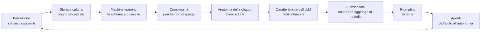

# Il metodo

Il mio metodo non ha ancora un nome, ma le regole sono chiare. Le ho imparate prima in classe, poi in azienda, poi nei corsi con executive e imprenditori. Qui le scrivo come le applico, non come vorrei che fossero.

## Il problema da cui parto

La maggior parte della formazione sull'AI è operativa: apri ChatGPT, scrivi questo prompt, clicca qui. Funziona per due settimane. Poi cambia l'interfaccia, cambia il modello, e il prompt che funzionava non funziona più. Chi ha imparato solo il "come" resta a piedi.

> Se tu sai cos'è l'input, cos'è l'applicazione, che c'è un modello dietro e cos'è l'output, hai lo schema. E lo riapplichi a tutte le applicazioni che incontri.

Stiamo formando le persone come se fossero operai da addestrare su una macchina. Ma con una tecnologia che si muove così veloce anche l'operaio deve avere una testa da manager: deve capire abbastanza da adattarsi quando il terreno cambia sotto i piedi.

## L'obiettivo

**Conoscere per partecipare in modo attivo e consapevole alla rivoluzione dell'AI generativa.**

Tre parole contano:

- **Conoscere**: sapere cosa c'è sotto, non solo come si usa. Senza scendere nella matematica universitaria, ma senza raccontare favole.
- **Attivo**: se il cambiamento lo aspetti, lo subisci.
- **Consapevole**: il problema non è che l'AI venga usata male. Il problema è che non ce ne rendiamo conto.

## I principi { #principi }

Per ogni principio: cosa vuol dire, come lo faccio in aula, dove rischio di tradirlo.

---

### 1. Prima la percezione, poi i contenuti

Il giro di presentazioni classico ("nome, ruolo, aspettative") dura un'ora e non mi dice quasi niente. Mi interessa di più capire come sei messo rispetto all'AI: curioso, spaventato, entusiasta, già dipendente.

**In aula:**
- [Haiku sull'AI](nuclei/01-percezione.md#haiku-sull-ai): scritto a mano, poi confrontato con quelli della macchina, poi analizzato dalla macchina.
- Tre parole: "scrivi a mano tre parole che ti vengono in mente pensando all'AI", poi statistica per tavolo.
- Una domanda nel giro di presentazione: *quanto sei dipendente dall'AI in questo momento?*

**Il rischio:** fermarsi alla fotografia. La percezione raccolta all'inizio va ripresa alla fine, altrimenti è solo un rompighiaccio.

---

### 2. Le parole sono la base

> Quando dici machine learning e il tuo interlocutore ha in testa lo stesso concetto, avete un terreno comune. Se no, state parlando di due cose diverse.

C'è già abbastanza rumore mediatico sull'AI. Ognuno dice la sua, anche gli esperti. All'inizio di ogni corso do il permesso esplicito di sgridare chi usa male i termini, me compreso.

**In aula:** l'obiettivo dichiarato del primo giorno è che a fine giornata tutti sappiano spiegare a chiunque cos'è il machine learning, e distinguere modello, applicazione, input, output e dataset. Se non ci arriviamo, ho fallito io.

**Il rischio:** diventare pedanti. La precisione serve a capirsi, non a fare l'esame.

---

### 3. Prima le mani, poi la teoria

Il concetto si appoggia su qualcosa che hai fatto con il corpo: piegare un foglio, disegnare un supercomputer con il mantello, spostare un post-it, cantare.

**In aula:** [il foglietto](nuclei/03-machine-learning.md#il-foglietto), un A4 piegato in quattro che diventa la mappa del machine learning. Il [gioco della frase a catena](nuclei/05-anatomia-chatbot.md#frase-a-catena) per capire come genera un LLM.

**Il rischio:** che il gesto diventi folklore. Ogni attività manuale deve lasciare uno schema che si riusa.

---

### 4. L'arte come strumento per conoscere

Scrivere un haiku sull'AI ti obbliga a dire cosa pensi in 17 sillabe. Poi la macchina ne scrive dieci in un minuto, e lì nasce la domanda giusta: *siamo scarsi noi, o è brava la macchina?*

La canzone sull'AI che uso in apertura l'ho scritta con mia figlia. Serve a far ricordare quattro concetti, e anche a dire una cosa: chi predica la creatività deve praticarla.

**In aula:** haiku, rap (all'università), poesia nello stile di un autore, la canzone. In pratica non chiedo di fare arte per decorare la lezione. La uso per spostare le persone fuori dalla zona di comfort e per mettere un pezzo di sé nel testo.

**Il rischio:** chi si sente "poco creativo" si blocca. Il vincolo (5-7-5) aiuta: sposta l'attenzione dal talento alla sfida.

---

### 5. La storia smonta l'hype

Il sogno di creare qualcosa di autonomo c'è nei miti greci (Talos), nella cultura ebraica (il Golem), nel Settecento (il Turco meccanico). L'articolo di Turing del 1950 ha già posto quasi tutte le domande che oggi sembrano nuove.

**In aula:** la [linea del tempo](nuclei/02-storia-e-cultura.md#linea-del-tempo) costruita dai partecipanti, la lettura ad alta voce di Turing, il Turco meccanico come chiave per parlare del lavoro nascosto dietro l'"automazione".

**Il rischio:** che la storia diventi un elenco di date. La domanda guida è sempre: cosa ci dice questo evento sull'oggi?

---

### 6. Uno schema generalizzabile batte cento istruzioni

Lo schema a 6 caselle del machine learning (dataset, hardware, algoritmo, modello allenato, applicazione, input/output) funziona per ChatGPT, per Spotify, per la fotocamera che riconosce i volti, per il meteo.

**In aula:** dopo averlo costruito, lo si applica a sistemi diversi. È l'esercizio di trasferimento: se regge su altri casi, l'hai capito.

**Il rischio:** semplificare troppo. Lo schema è volutamente grezzo; lo dico in aula.

---

### 7. L'esperimento che fallisce insegna più di quello che riesce

Lavoro per indagine: faccio fare un'esperienza, si osserva cosa succede, poi si cerca il perché.

**In aula:**
- "Riassumi l'articolo 189 della Costituzione" → risposta credibile su un articolo che non esiste (gli articoli sono 139).
- "Dammi tre video YouTube per imparare l'ukulele" → link perfetti e inesistenti.
- Il dilemma del carrello con le persone *già morte* → il modello non se ne accorge.
- Il conteggio delle sillabe negli haiku generati.

**Il rischio:** il test che non riproduce. I modelli cambiano e un esperimento che fallisce oggi domani può riuscire. Per questo ogni esperimento va riverificato (vedi [manutenzione](manutenzione.md)).

---

### 8. Abitare la complessità

Un orologio è complicato: si rompe un ingranaggio, lo sostituisci, torna come prima. Una classe è complessa: se manca una persona, cambia tutto. I sistemi di deep learning hanno attraversato il confine tra complicato e complesso. Neppure chi li costruisce sa spiegare fino in fondo perché danno quella risposta.

**In aula:** non nascondo le domande senza risposta. "Non lo sappiamo" è una risposta legittima. Chiedo però di non avere ansia: l'atteggiamento giusto è la consapevolezza.

**Il rischio:** usare la complessità come scusa per non spiegare quello che invece si può spiegare.

---

### 9. Il validatore sei tu, e le fonti contano

Nessuna azienda ha costruito un validatore delle risposte. Chi usa la risposta se ne prende la responsabilità.

**In aula:** aprire le fonti della ricerca web, il "doppio livello di opacità" (perché ha scelto quelle fonti e come le ha usate), la validazione incrociata tra modelli diversi. E il messaggio che più spiazza: **studiate di più, non di meno**. I dettagli sbagliati nelle pieghe del testo li vede solo chi è esperto.

**Il rischio:** generare sfiducia totale. La fiducia non esiste a priori: si costruisce provando, come abbiamo fatto con i motori di ricerca.

---

### 10. Il formatore ci sta dentro

Dichiaro come uso io l'AI, compreso quello che non delego (le email e i post li scrivo io, perché mi piace scrivere). Costruisco gli strumenti che uso in aula (la demo della finestra di contesto, il simulatore di scenari per il prompting, il sito sulle tecniche). Dichiaro anche i miei limiti, compresi quelli cognitivi: anch'io non riesco a stare dietro a tutto.

**Il rischio:** che diventi autobiografia. Il racconto personale serve se illumina una scelta che anche il partecipante deve fare.

---

### Una tesi, non un principio: prima la tecnica, poi l'etica

Nei miei corsi l'etica c'è sempre, ma arriva dopo aver capito i pezzi della catena. Sostengo che non si possa ragionare seriamente sulle implicazioni etiche di qualcosa che non si sa come funziona. Molte riflessioni sull'AI sono belle frasi senza concretezza perché manca la base tecnica.

È una posizione discutibile, e la metto qui come tesi. L'obiezione più seria: rimandare l'etica dopo la tecnica rischia di presentare la tecnica come neutra, e la tecnologia non è neutra (lo dico io stesso in aula). La sintesi che provo a tenere: **l'etica non è un modulo a parte, sta dentro ogni modulo tecnico**. Il Turco meccanico parla di lavoro nascosto, il dataset parla di chi decide cosa è realtà, la memoria della chatbot parla di privacy.

## Le fondamentaIl metodo poggia su alcune tradizioni pedagogiche e culturali: costruzionismo, educazione attraverso l'arte, storia della tecnologia, apprendimento per problemi, progetti e indagine, Training from the Back of the Room, Bruno Munari, Reggio Children, studi di futuro, pensiero complesso.

In [fondamenta.md](fondamenta.md) faccio una cosa scomoda: per ognuna dico quanto si vede davvero nei miei corsi, e dove invece è solo dichiarata.

## Come è organizzato il corso

La freccia tratteggiata non è un vezzo. Alla fine si torna alla percezione: cosa è cambiato in te rispetto a due giorni fa?

