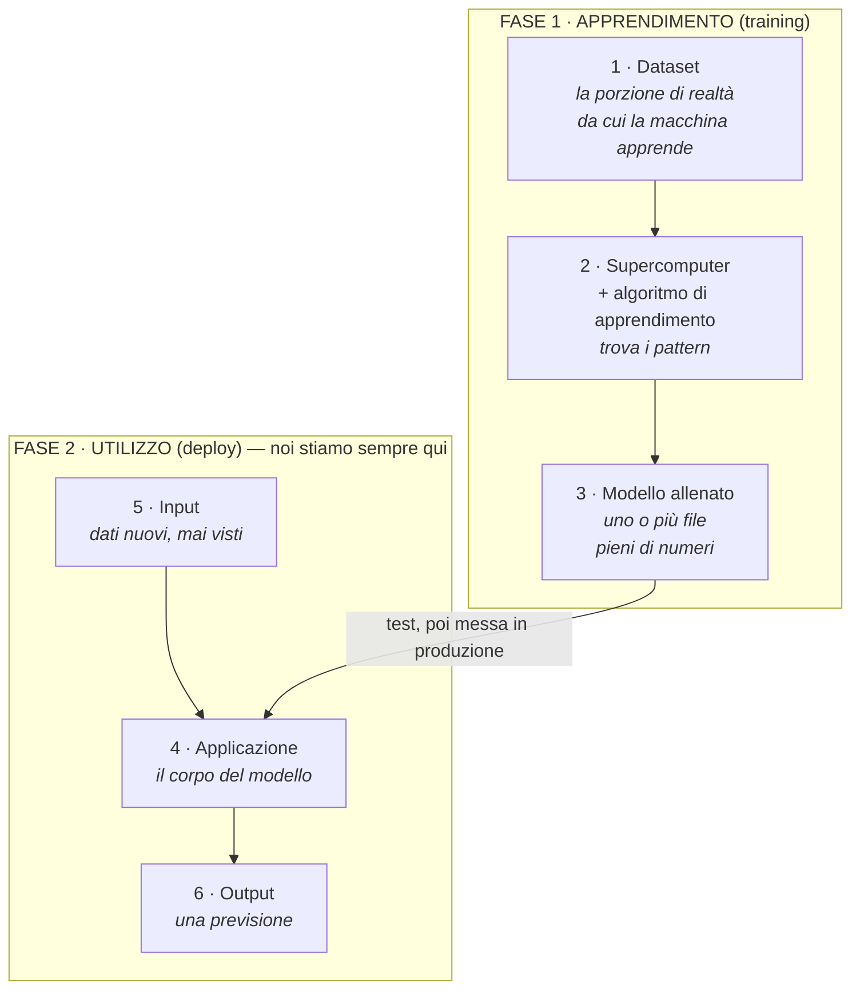
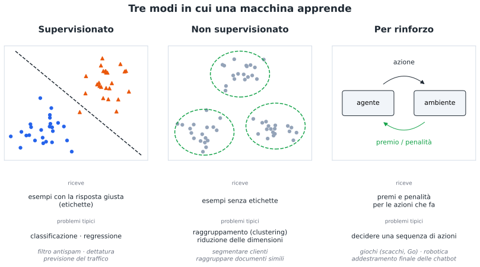
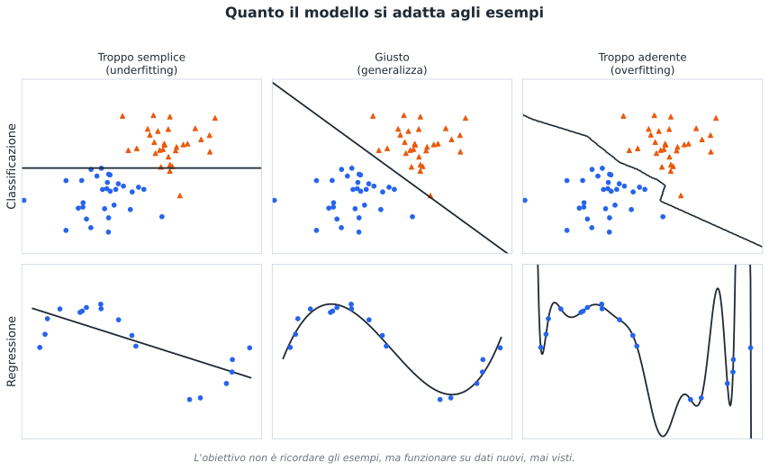

# M03 · Machine learning, lo schema a 6 caselle

> Il dataset è la porzione di realtà da cui la macchina apprende.

## Perché questo modulo

Quasi tutto quello che oggi chiamiamo AI (chatbot, raccomandazioni, riconoscimento facciale, traduzione) è machine learning. Se non hai chiaro come si crea un sistema di machine learning, vedi solo la punta dell'iceberg. E come per il Titanic, quello che ti affonda è sotto.

È anche il modulo che rende possibile tutto il resto. Al corso sugli agenti chi non ha chiara la differenza tra modello e applicazione non capisce niente. Per questo in aula lo dico chiaro: **entro domani sera dovete sapere cos'è un modello, cos'è un'applicazione, cos'è un input, cos'è un output e cos'è un dataset. Se non succede, ho fallito io.**

## Obiettivi

Alla fine del modulo il partecipante:

- distingue intelligenza artificiale, machine learning, deep learning e chatbot (insiemi uno dentro l'altro);
- spiega a chiunque cos'è il machine learning: **macchine che apprendono in modo automatico da esempi**;
- descrive le due fasi (apprendimento e utilizzo) e sa che come utenti stiamo sempre nella seconda;
- nomina le 6 caselle dello schema e le applica a un sistema che non abbiamo visto in aula;
- sa che **i modelli non imparano mentre li usiamo**.

## Concetti chiave

| Concetto | Come lo dico in aula | Stabilità |
|---|---|---|
| AI ⊃ ML ⊃ DL ⊃ chatbot | Un insieme gigante (l'AI, disciplina transdisciplinare) con dentro il machine learning, con dentro il deep learning, con dentro le chatbot | stabile |
| Machine learning | Apprendimento automatico, *da esempi*. Non devo più spiegare alla macchina come fare: le faccio vedere tanti esempi e impara | stabile |
| Deep learning | Machine learning con reti neurali artificiali in configurazioni complesse | stabile |
| Due fasi | Prima si impara (*training*), poi si usa (*deploy*, dopo il test). Sono sequenziali. Il marketing le mescola | stabile |
| Dataset | Gli esempi. La porzione di realtà da cui la macchina apprende. E tutto diventa numero | stabile |
| Algoritmo di apprendimento | La sequenza di calcoli che trova i pattern negli esempi. Algoritmo vuol dire solo "sequenza di operazioni": anche allacciarsi le scarpe è un algoritmo | stabile |
| Modello allenato | Uno o più file pieni di numeri che contengono ciò che la macchina ha imparato. Da solo non fa niente | stabile |
| Applicazione | Il "corpo" che permette di usare il modello. ChatGPT è un'app, GPT-x è il modello | stabile |
| Input | Dati nuovi, mai visti. Un sistema che sapesse rispondere solo a ciò che ha già visto non sarebbe intelligente | stabile |
| Output | Sempre una previsione (in termini tecnici: inferenza). Quindi sempre con un margine d'errore | stabile |
| GIGO | *Garbage in, garbage out*: esempi spazzatura, previsioni spazzatura | stabile |

## Come lo conduco

### 1. Lo strumento definitivo (10 minuti)

Distribuisco un A4 a testa. Lo pieghiamo a metà, poi ancora a metà, poi portiamo le alette esterne dalla stessa parte: diventa un piccolo libretto. Lo chiamo "lo strumento definitivo" con tono solenne. Fa ridere, ed è il punto: abbassa la tensione prima di un argomento che molti temono.

Scheda completa: [il foglietto](#il-foglietto).

### 2. Gli insiemi (15 minuti)

Sul primo lato disegniamo un insieme grande: AI. Prima di andare dentro, ricordo cosa c'è in quell'insieme: matematica, informatica, ma anche psicologia, filosofia, etica. Poi il sottoinsieme machine learning. Chiedo come si traduce. Qualcuno dice "addestramento automatico", qualcuno "apprendimento automatico". Mi fermo sul senso: **macchine che apprendono**. Faccio scrivere: *da esempi*.

Poi deep learning (reti neurali artificiali in configurazioni complesse) e chatbot. Li accenno e basta: i dettagli matematici non servono, e lo dico.

Da qui c'è un aggancio diretto al [modulo sulla complessità](04-complessita.md): sopra un certo numero di nodi la rete neurale diventa complessa e non è più spiegabile.

### 3. Le due fasi (20 minuti)

Giriamo il foglio. Disegniamo una tabella di tre colonne e due righe, sfruttando le pieghe: in alto le caselle 1, 2, 3 (apprendimento), in basso 4, 5, 6 (utilizzo). Le alette servono a coprire e scoprire una fase alla volta.

Prima domanda alla classe: **noi, nella vita, in quale fase stiamo?** La risposta corretta (in basso, nell'utilizzo) di solito arriva, ma serve dirla ad alta voce. A meno che tu non lavori in OpenAI, Google o Anthropic, sei sempre lì.

**Fase di apprendimento**
1. **Dataset**: gli esempi. Chiedo: come li chiamiamo? Escono "dati", "training", poi "dataset". Poi la frase da scrivere e su cui riflettere: *il dataset è la porzione di realtà da cui la macchina apprende*. Porzione, perché qualcuno ha scelto cosa metterci dentro. Gli esempi diventano tutti numeri: i pixel sono numeri, i testi diventano numeri.
2. **Hardware**: disegniamo un computer con il mantello. È un supercomputer, e la canzone ce l'aveva già detto: senza matematica non va, e la matematica gira su macchine enormi.
3. **Algoritmo di apprendimento** e **modello allenato**: i calcoli che trovano i pattern negli esempi, e il file che ne esce.

**Fase di utilizzo**
4. **Applicazione**: disegniamo un tablet con un dito che lo tocca. Il modello è un cervello senza corpo, l'app è il corpo.
5. **Input**: dati nuovi, mai visti.
6. **Output**: una previsione.

### 4. L'analogia dello studente (10 minuti)

La uso dichiarando che serve a capire il processo, non ad antropomorfizzare la macchina.

> L'insegnante di storia ti dice: studia la Rivoluzione francese da pagina 43 a 62. Quelle pagine sono il dataset. Il cervello è l'hardware. Il metodo di studio è l'algoritmo: c'è chi sottolinea, chi fa lo schema, chi si registra e si riascolta. Esistono tanti algoritmi di apprendimento perché esistono tanti metodi. Quello che ti resta in testa, una mappa di concetti collegati, è il modello allenato.

La differenza da sottolineare subito dopo: **il cervello umano è plastico**. Se sbagli 10 domande su 20 alla verifica, ripassi solo quelle. Un modello allenato no: per insegnargli qualcosa di nuovo bisogna rifare l'apprendimento. Per questo i modelli escono versione dopo versione, e ogni versione è diversa come lo sono dei fratelli.

### 5. Esempi d'uso (10 minuti)

- **Google Maps**: l'input è dove sei, dove vuoi andare, a che ora. L'output è la previsione del traffico. A volte ci prende, a volte no.
- **Meteo**: un tempo i fisici dell'atmosfera scrivevano equazioni lunghissime. Oggi quella formula la genera l'algoritmo a partire dagli esempi. È un cambiamento epistemologico enorme: si costruisce meno teoria e si imitano di più gli andamenti dei dati.
- **La chatbot**: le dai un input e lei prevede la risposta migliore.

### 6. Esercizio di trasferimento (25 minuti)

A gruppi, si applica lo schema a sistemi diversi. Scheda: [schema a 6 caselle su altri sistemi](#sei-caselle-trasferimento).

- **Raccomandazioni** (Spotify, Netflix, YouTube): dataset = storico degli ascolti di tutti. Il sistema trova utenti simili e incrocia ciò che uno ha e l'altro no. È apprendimento non supervisionato.
- **Speech-to-text** (la dettatura sul telefono): dataset = registrazioni audio con la trascrizione corretta. È supervisionato. Se nel dataset non ci sono certi accenti, il sistema li riconosce peggio.
- **Riconoscimento facciale** (il quadratino nella fotocamera): dataset = immagini di volti, cioè pixel, cioè numeri. Il modello deve generalizzare: riconoscere tutti i volti, non solo quelli visti.
- **Generazione di testo**: dataset = un corpus mostruoso di testi. Il modello impara grammatica, sintassi, lingue, e gestisce numericamente i significati.

Chi fa tutto giusto vince una canzone personalizzata. Non è una battuta: la scrivo davvero.

### 7. Chiusura: modello ≠ applicazione (10 minuti)

> Dove sta l'intelligenza in un'app di AI? Nel modello. Se togli il modello, l'app non è più intelligente.

Due conseguenze pratiche:
- Quando qualcuno ti dice "uso ChatGPT", la domanda giusta è: *con quale modello?*
- Quando un fornitore dice "te lo faccio io il modello, su misura per te", chiedi cosa intende. Allenare un modello costa: dati, calcolo, energia, competenze. Spesso si tratta di un modello esistente adattato. Va bene, ma va detto.

## Frasi che uso

- "Il dataset è la porzione di realtà da cui la macchina apprende."
- "Noi siamo sempre nella fase di utilizzo."
- "Il modello allenato è un file pieno di numeri. Finché non lo metti da qualche parte, non fa male a nessuno."
- "Mentre lo usi, il modello non sta imparando."
- "Algoritmo vuol dire solo sequenza di operazioni. Anche la ricetta dei pancake."

## Errori frequenti

**Dei partecipanti**
- Pensare che la chatbot "impari da me" mentre ci parlo. È un'altra funzionalità (la memoria dell'app), non il modello che impara. Lo si chiarisce nel [modulo funzionalità](07-funzionalita.md).
- Confondere app e modello ("ChatGPT 5").
- Chiedere come si "traduce un video in numeri" troppo presto. Va bene parcheggiare la domanda: ci si arriva con i token.

**Miei**
- Correre. Questo modulo regge tutto il resto: meglio sacrificare un esempio che lasciare dubbi sulle due fasi.
- Rispondere alle domande sulle funzionalità (ricerca web, memoria) dentro questo modulo. Le parcheggio esplicitamente: "è un altro livello, ci arriviamo".

## Attività brevi

- **Disegna come funziona il machine learning** (warm-up, 10 min): "prova a fare uno schema grafico di come funziona il machine learning. Puoi usare tutti gli strumenti di AI che conosci." Si confrontano gli schemi prima del foglietto, e si riguardano dopo.
- **AI predittiva e generativa** (5 min): tre slide in progressione. AI (machine learning) → predittiva, che **prevede** eventi futuri, e generativa, che **crea** nuovi contenuti. Entrambe si basano su **pattern appresi** da dati esistenti. Ultimo passaggio: anche la generativa **prevede**, cioè prevede il contenuto migliore rispetto alla richiesta. È il ponte verso il nucleo 5.
- **Training e test** (5 min): il dataset si divide in due. Una parte serve ad apprendere (fase 1), l'altra a verificare che il modello funzioni su esempi mai visti (fase 2).

- **Dataset non è database** (5 min): un database relazionale ha già le relazioni scritte; il machine learning le ricava dagli esempi. Il passaggio reale è *data lake → selezione → pulizia → dataset*. Se insegni a distinguere cani e gatti, le foto di cavalli le togli tu. Gli esempi li sceglie e li pulisce qualcuno.
- **Perché l'applicazione è la casella 4, al centro** (3 min): numero le caselle di sotto 5-4-6 e aspetto la domanda. L'applicazione deve esistere prima dei dati nuovi, perché i dati nuovi nascono quando la usi.
- **Riconoscimento facciale, a fondo** (5 min): il sistema non sa cos'è un occhio. Impara un pattern di pixel dai riquadri disegnati da persone sulle foto. Per riconoscere gli occhi serve un altro dataset, con i riquadri sugli occhi.
- **Le mappe: storico più tempo reale** (3 min): la previsione del traffico combina un modello allenato sui dati storici con i dati che arrivano adesso dai dispositivi.
- **Apprendimento per rinforzo** (5 min): un video di un robot che impara a camminare per tentativi, poi viene disturbato su terreni diversi. Programmarlo a mano sarebbe ingestibile. Il premio può darlo una persona o un sensore. Analogia del cane e della crocchetta, dichiarata come analogia.
- **Classificazione e clustering** (3 min): la classificazione è supervisionata (le categorie le decide chi prepara gli esempi). Il clustering è non supervisionato (i gruppi li trova il sistema).
- **Ripasso a inizio incontro**: il quiz sullo schema a 6 caselle.

Dal percorso per la scuola:

- **Indovina la mia età** (20 min): la classe fa domande al docente, tutte permesse tranne "quanti anni hai?". Ragionando sugli indizi stima l'età. Poi la stessa stima la fa una macchina, da una foto del docente. Come ha ragionato la classe, come la macchina? Solo sul volto del docente: mai su quello degli studenti.
- **Disegni per una macchina** (15 min): Quick, Draw! di Google. Si disegna e la macchina indovina, perché ha visto milioni di disegni fatti da altri. Poi si guardano gli esempi da cui ha imparato.
- **Ripasso scritto** (30 min, a inizio incontro): "scrivi come funziona il machine learning o fanne uno schema", consegnato e rivisto insieme.

## Punti critici e da verificare

- **Semplificazione dichiarata**: lo schema non distingue pre-training, fine-tuning e reinforcement learning. Per un pubblico tecnico va aggiunta una nota.
- **I modelli non "degradano"**: un modello fermo non cambia. Cambiano il mondo (*data drift*) e le versioni che le aziende servono sotto lo stesso nome.
- **Analogia del cane addestrato**: efficace per dire "statistico, non deterministico", ma rischia di antropomorfizzare. Da usare con la stessa avvertenza dell'analogia dello studente.

- **Apprendimento continuo**: alcuni sistemi (raccomandazioni, antifrode) vengono riaddestrati spesso. Un LLM in uso invece ha i pesi fermi: si aggiorna con una nuova versione. Non dire "l'apprendimento continuo non esiste": di' "il modello che stai usando non sta imparando".

## Schede attività

### Il foglietto (lo strumento definitivo) { #il-foglietto }

**Durata:** 60–90 minuti (dentro il modulo M03) · **Gruppo:** individuale, guidato in plenaria · **Materiali:** un A4 a testa, penne o pennarelli

**In una frase:** un A4 piegato in quattro diventa la mappa del machine learning, da tenere in tasca.

#### Perché la faccio

Il machine learning spaventa. Un foglio di carta no. Piegarlo insieme abbassa la tensione, rallenta il ritmo e dà a tutti lo stesso oggetto. Alla fine ognuno ha uno schema scritto di suo pugno, che si apre e si chiude come un libretto, e che si riusa per ogni sistema di AI.

Lo presento con tono solenne come "lo strumento definitivo". Fa ridere, ed è voluto.

#### Cosa serve

Un A4 a testa. Penne. Niente schermi.

#### Passaggi

1. **Piega.** A metà, poi ancora a metà. Riapri. Porta le due alette esterne dalla stessa parte, in modo che si chiudano sopra la parte centrale. Gira il foglio in orizzontale.
2. **Lato A: gli insiemi.** Un grande insieme "AI". Dentro "machine learning: macchine che apprendono in modo automatico *da esempi*". Dentro "deep learning: reti neurali artificiali in configurazioni complesse". Dentro "chatbot".
3. **Lato B: la tabella.** Seguendo le pieghe, una tabella di tre colonne e due righe. In alto 1, 2, 3 (**fase di apprendimento**), in basso 4, 5, 6 (**fase di utilizzo**). Le alette coprono una fase per volta.
4. **Riempi le caselle** mentre spiego (vedi [M03](#)):
   - 1 · Dataset — *la porzione di realtà da cui la macchina apprende*
   - 2 · Supercomputer (disegnato con il mantello) + algoritmo di apprendimento
   - 3 · Modello allenato — *uno o più file pieni di numeri*
   - 4 · Applicazione (un tablet con un dito)
   - 5 · Input — *dati nuovi, mai visti*
   - 6 · Output — *una previsione*
5. **Chiudi e apri.** Alette chiuse sopra: si vede solo come si crea. Alette chiuse sotto: si vede solo come si usa. "Noi dove stiamo? Sempre qui sotto."

#### Debriefing

- In quale fase stiamo noi, tutti i giorni?
- Se voglio che il modello sappia una cosa nuova, in quale casella devo intervenire?
- Dove sta l'intelligenza in un'app di AI?

#### Cosa può andare storto

- Qualcuno sbaglia la piega. Va benissimo: si piega un altro foglio. Gli ingegneri di solito sono i più precisi, e lo faccio notare.
- Si corre troppo sulle caselle 2 e 3. Meglio rallentare: sono quelle che reggono il resto del corso.

#### Varianti

- **Con bambini e ragazzi**: le stesse caselle con esempi della loro vita (il riconoscimento del volto nella fotocamera, i video consigliati).
- **Ripasso del giorno dopo**: si riapre il foglietto e si interroga a vicenda.
- **Trasferimento**: dopo il foglietto, [lo schema applicato ad altri sistemi](#sei-caselle-trasferimento).

#### Cosa ho visto succedere

Un partecipante a fine giornata: "Non siamo andati in profondità, ma per la prima volta ho capito a blocchi cosa c'è dietro. Allenare la testa a ragionare su questi blocchi è diverso da quello che facevo fino a tre ore fa."

### Lo schema a 6 caselle su altri sistemi { #sei-caselle-trasferimento }

**Durata:** 25 minuti · **Gruppo:** piccoli gruppi · **Materiali:** il foglietto di ognuno, una scheda con 4 sistemi

**In una frase:** se lo schema regge anche su Spotify, sulla dettatura e sulla fotocamera, l'hai capito.

#### Passaggi
A ogni gruppo un sistema. Compilare le 6 caselle: dataset, hardware e algoritmo, modello allenato, applicazione, input, output.

| Sistema | Dataset | Applicazione | Input | Output |
|---|---|---|---|---|
| Raccomandazioni musicali | Storico degli ascolti di tutti gli utenti | Spotify, YouTube Music… | Cosa stai ascoltando, i tuoi interessi | Il prossimo brano |
| Dettatura (speech-to-text) | Registrazioni audio + trascrizione corretta | La tastiera del telefono | La tua voce | Il testo |
| Riconoscimento facciale | Immagini di volti | La fotocamera | Lo streaming video | Il quadratino sul volto |
| Generazione di testo | Un corpus enorme di testi | La chatbot | Il prompt | Il testo |

#### Debriefing
- Cosa succede se nel dataset della dettatura mancano certi accenti?
- Perché le raccomandazioni si chiamano "non supervisionate" e la dettatura "supervisionata"?
- In quale casella sta il problema quando il sistema sbaglia?

Chi compila tutto giusto vince una canzone personalizzata.

> **Da rivedere.** Scheda ricostruita dai materiali di un corso per la scuola: va controllata e completata.

### Alleno un modello e ci costruisco un gioco { #alleno-un-modello }

**Durata:** 2 ore · **Gruppo:** coppie a un computer · **Materiali:** un ambiente di programmazione a blocchi con estensioni di AI (per esempio RAISE Playground del MIT), Teachable Machine · **Schermi:** sì

**In una frase:** si allena un piccolo modello su oggetti di uso comune e lo si usa dentro un videogioco a blocchi.

#### Perché la faccio

È lo schema a 6 caselle fatto con le mani. Dataset (le foto), addestramento (pochi secondi), modello allenato (un link), applicazione (il gioco), input nuovo (l'oggetto davanti alla webcam), output (la previsione).

#### Passaggi

1. **Tutorial (20 min).** Due tutorial guidati dell'ambiente a blocchi.
2. **Il modello (30 min).** In Teachable Machine si allena un modello su quattro oggetti (libro, astuccio, borraccia, quaderno). Si esporta e se ne copia il link.
3. **Il gioco (40 min).** Il link si incolla nel blocco dell'estensione: il gioco reagisce all'oggetto mostrato.
4. **La tua idea (30 min).** Ogni coppia propone e prototipa un gioco che usi un modello.

#### Debriefing

- Cosa succede se mostri un oggetto che il modello non ha mai visto?
- Quante foto servono? Cosa cambia se sono tutte sullo stesso sfondo?

#### Cosa può andare storto

- **Volti ed emozioni:** alcuni esperimenti già pronti riconoscono espressioni del volto. Con i minori si usano oggetti, non volti: sono dati biometrici. E l'AI Act vieta dal 2025 i sistemi che riconoscono le emozioni nelle scuole. Un esperimento didattico è un'altra cosa, ma è meglio non avvicinarsi.
- Il link del modello lo pubblica online: dentro ci sono le foto dell'addestramento.

## Schemi

### Le 6 caselle del machine learning { #schema-sei-caselle }

**Da ricordare:** mentre lo usi, il modello non impara. Per insegnargli qualcosa di nuovo bisogna tornare alla fase 1.

### Tre modi in cui una macchina apprende { #schema-tipi-apprendimento }

Figura originale (CC BY 4.0), generata da `scripts/genera_figure_ml.py`. Sostituisce le immagini prese dal web sulla board.

### Quanto il modello si adatta agli esempi { #schema-adattamento }

Il modello troppo semplice non coglie il pattern. Quello troppo aderente impara a memoria anche il rumore e sbaglia sui dati nuovi. Vale per la classificazione e per la regressione.

### Il foglietto { #schema-foglietto }

Sorgente modificabile: [foglietto.excalidraw](../schemi/foglietto.excalidraw), da aprire su excalidraw.com.

Sulla mia lavagna Miro il foglietto è anche una sequenza di slide: prendi un A4 → piega (passo 1 e 2) → piega le alette e scrivi sul retro gli insiemi (AI, ML, DL) → gira il foglio e scrivi sulle alette le fasi → apri le alette e scopri gli elementi di ogni fase. Ogni slide ha una versione vuota, da compilare a mano davanti alla classe.
