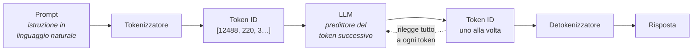

# M05 · Anatomia della chatbot, token e LLM

> Se pensate che la chat stia leggendo quello che avete scritto, vi sbagliate di grosso. Sta leggendo una sequenza di numeri.

## Perché

Tra quando premi invio e quando compare la risposta succedono cose che spiegano quasi tutti i comportamenti strani delle chatbot: perché sbaglia i conti, perché l'italiano costa più dell'inglese, perché la risposta esce "una parola alla volta", perché non fa copia-incolla.

## Obiettivi

- Disegnare il percorso prompt → tokenizzatore → token ID → LLM → token ID → detokenizzatore → risposta.
- Vedere con i propri occhi come un testo viene spezzato in token.
- Capire che un LLM è un **predittore del token successivo** e che genera sul momento, senza copiare.
- Trarre conseguenze pratiche: lingua, costi, calcoli.

## Concetti chiave

| Concetto | Come lo dico | Stabilità |
|---|---|---|
| Chatbot | Chat + bot (da *robot*, dal ceco *robota*, lavoro servile; Čapek, *R.U.R.*, 1920). Uno "schiavo delle chiacchiere" | stabile |
| Prompt | Un'istruzione in linguaggio naturale. "Linguaggio naturale" è un termine tecnico | stabile |
| Token | Sequenza di caratteri a cui è associato un numero. Come i mattoncini Lego: non si mescolano, si combinano | stabile |
| Tokenizzatore | Ogni famiglia di modelli ha il suo. Lo spezzettamento lo decide un'ottimizzazione matematica, non un linguista | stabile |
| LLM | *Large language model*: il modello allenato che gestisce il linguaggio. Il motore | stabile |
| Predittore del token successivo | Produce un token alla volta, rileggendo ogni volta quello che ha già scritto | evolutivo |
| Niente copia-incolla | La risposta è generata sul momento. Per questo costa energia, come lo streaming rispetto alla parabola | stabile |
| Numeri come testo | I numeri vengono trattati come testo, non come quantità. Per i calcoli servono strumenti (code interpreter) | evolutivo |
| Lingua e costi | L'inglese usa meno token dell'italiano: meno calcoli, meno costo. L'italiano funziona comunque bene | volatile |

## Come lo conduco

1. **Etimologia** (5 min). Chat, bot, robot, Čapek. I robot originali di *R.U.R.* erano biologici, non meccanici.
2. **Lo schema** (10 min). Lo disegniamo insieme sul quaderno. Schema: [schema: anatomia-chatbot](#schema-anatomia-chatbot).
3. **Laboratorio sul tokenizzatore** (25 min). Scheda: [tokenizzatore](#tokenizzatore).
4. **Implicazioni** (10 min). Inglese vs italiano; si paga a token (negli agenti non esistono tariffe flat); i numeri sono testo; un minimo di gentilezza nel prompt aiuta, perché scrivi meglio tu, non perché il modello è più disponibile.
5. **Il gioco della frase a catena** (15 min). Scheda: [frase a catena](#frase-a-catena).
6. **Niente copia-incolla** (10 min). "Chi vi dice che la chatbot fa copia-incolla, bocciatelo." Il caso dei libri protetti da copyright che a volte il modello "rigurgita": memorizzazione, non ricerca.
7. **Dati e privacy** (10 min). Dove va il prompt quando premo invio? Account gratuiti, a pagamento, aziendali. Rimando a [M11](11-dati-etica-potere.md).

## Frasi che uso

- "Il prompt per l'umano è una sequenza di parole. Per la macchina, una sequenza di numeri."
- "Non è design: il testo esce piano piano perché viene generato piano piano."
- "Non c'è un linguista, non c'è Chomsky. C'è un problema di ottimizzazione."

## Attività brevi

- **Chat + bot** (5 min): le parole aprono il nucleo: *chat* in inglese è chiacchierare; *bot* da robot, parola nata nel 1920 con il dramma *R.U.R.* di Karel Čapek ([testo su Gutenberg](https://gutenberg.org/files/59112/59112-h/59112-h.htm)).
- **Prima e dopo** (10 min): uno screenshot con la domanda (prima) e uno con la risposta (dopo). In mezzo: *cosa succede qui?* Si costruisce lo schema: LLM (predittore del token successivo) → interpreta il testo in input → produce una risposta in linguaggio naturale. Poi cut-off (limite di conoscenza, legato al dataset), finestra di contesto, allucinazioni.

- **Altre prove con il tokenizzatore**: maiuscole e minuscole danno token diversi; un'emoji si spezza in più token; un numero lungo si spezza a gruppi di tre cifre, senza rispettare il valore posizionale ("la maestra elementare ti boccerebbe"); un token vale in media circa quattro caratteri in inglese.
- **Il tokenizzatore è la biella**: ogni modello ha il suo e non si smonta. Scegli il modello, ti porti dietro il suo tokenizzatore.
- **Quanto costa** (5 min, per chi decide): nelle applicazioni su misura si paga a token. Si fa una fase di test, si contano i token consumati e si stima il costo con un calcolatore dei prezzi.
- **Multimodale** (10 min): un modello è multimodale quando gestisce più tipi di dati, per esempio testo e immagini, in input e a volte in output. Nativo o con un traduttore in mezzo? Lo screenshot entra nel modello (passando da un componente che trasforma l'immagine in numeri). La voce di solito passa prima da un modello di trascrizione. Metafora: "se sai il cinese lo gestisci tu, se non lo sai hai un traduttore in mezzo".

## Punti critici e da verificare

- **Valori del tokenizzatore** (ID dei token, conteggi come "53 token in inglese, 81 in italiano"): dipendono dal modello e dalla versione dello strumento. Riverificare prima di ogni corso.
- **"100 token ≈ 75 parole"**: regola indicativa per l'inglese comune, dichiarata da OpenAI. Non vale per l'italiano.
- **Transformer**: introdotto da ricercatori Google nel 2017 (*Attention Is All You Need*), sperimentato sulla traduzione automatica ma pensato come architettura generale.
- **Hardware locale e prezzi**: le indicazioni su RAM e costi dei computer per i modelli locali sono volatili. Vedi [M08](08-modelli-e-ragionamento.md).

- **Le immagini non passano dal tokenizzatore del testo**: passano da un codificatore visivo che le trasforma in numeri. Non dire "il tokenizzatore legge l'immagine".

## Risorse per approfondire

- Andrej Karpathy, [*Deep Dive into LLMs like ChatGPT*](https://youtu.be/7xTGNNLPyMI) e [*How I use LLMs*](https://youtu.be/EWvNQjAaOHw).
- Visualizzazioni interattive: [LLM Visualization](https://bbycroft.net/llm), [Transformer Explainer](https://poloclub.github.io/transformer-explainer/).
- Anthropic, [*Interpretability: Understanding how AI models think*](https://www.youtube.com/watch?v=fGKNUvivvnc).
- [Hugging Face LLM Course](https://huggingface.co/learn/llm-course/chapter1/1).
- Tre metafore da discutere, non da adottare: *pappagallo stocastico*, *predittore del token successivo*, *rigurgitatore di internet*. Cosa colgono, cosa nascondono?

## Schede attività

### La frase a catena (un LLM in carne e ossa) { #frase-a-catena }

**Durata:** 15 minuti · **Gruppo:** 3 volontari + plenaria · **Materiali:** un elenco di parole da indovinare, visibile solo ai volontari

**In una frase:** due persone costruiscono una frase una parola alla volta senza sapere cosa dirà l'altra, una terza indovina la parola nascosta. È così che genera un LLM.

#### Perché la faccio

"Predittore del token successivo" è una formula che non dice niente a nessuno. Facciamo fatica a immaginare un sistema che produce una parola alla volta senza sapere come finirà la frase. Il gioco lo fa sentire: è ispirato a un classico dei quiz televisivi, quello in cui si costruisce una frase a turno per far indovinare una parola.

#### Cosa serve

Tre volontari. Un elenco di parole da far indovinare (penna, scrivere, ippodromo…), mostrato solo a due di loro.

#### Passaggi

1. Due volontari (A e B) vedono la parola segreta. Il terzo (C) no.
2. A e B costruiscono a turno **una frase di senso compiuto, una parola ciascuno**, senza dire la parola segreta e senza mettersi d'accordo.
3. C ascolta e prova a indovinare.
4. Dopo due o tre parole, ci si ferma e si spiega.

#### Debriefing

- A sapeva cosa avrebbe detto B? No. Eppure la frase aveva senso. Così funziona l'LLM: produce un token alla volta, non sa cosa verrà dopo, ma ogni volta **rilegge tutto quello che ha già scritto** e sceglie il seguito più probabile.
- Perché servono due persone e non una? Perché una sola persona sa già cosa vuole dire, e poi costruisce la frase. L'LLM no: è un "cervello diviso".
- Allora perché quando chiedi qualcosa la risposta esce piano piano? Non è un effetto grafico per sembrare umano. È il processo di generazione.
- Copia-incolla? No: ogni risposta è generata sul momento.

#### Cosa può andare storto

- I volontari sono troppo bravi e indovinano subito. Va bene: la spiegazione regge lo stesso. Tenere parole più difficili di riserva.
- Qualcuno prende il gioco troppo sul serio. Ricordare che è un'analogia: l'LLM non "pensa" le parole, calcola probabilità sui token.

#### Varianti

- Prima del gioco, scrivere alla lavagna "Io…" e chiedere alla classe la parola successiva più probabile ("sono"). Poi: "A mezzogiorno io ho…" ("fame").

### Dentro il tokenizzatore { #tokenizzatore }

**Durata:** 25 minuti · **Gruppo:** individuale · **Materiali:** browser · **Schermi:** sì — una demo pubblica di tokenizzatore (nel 2026 ho usato quella di OpenAI)

**In una frase:** guardare come una frase diventa pezzi e numeri, e scoprire che la macchina non legge parole.

#### Passaggi
1. Aprire la demo del tokenizzatore e caricare il testo di esempio. Contare token e caratteri. Attivare la vista degli ID: ecco cosa "legge" il modello.
2. Scrivere "money money money money" (o qualsiasi parola ripetuta). Gli ID non sono tutti uguali: lo spazio fa parte del token.
3. Una parola lunga: viene spezzata senza nessuna logica linguistica.
4. Scrivere una frase in italiano, poi incollarne la traduzione inglese: l'italiano usa più token.
5. Scrivere un numero lungo: viene spezzato come testo, non per unità, decine e centinaia.

#### Debriefing
- Chi ha deciso come spezzare le parole? Nessun linguista: un'ottimizzazione matematica, diversa per ogni famiglia di modelli.
- Più token vuol dire più calcoli, più tempo, più costo, più energia. Perché chi sviluppa agenti scrive i prompt in inglese?
- Perché le chatbot sbagliano i calcoli?

#### Cosa può andare storto
La demo a volte ha dei bug, e gli ID cambiano con le versioni dei modelli. Provarla sempre la sera prima.

## Schemi

### Anatomia della chatbot { #schema-anatomia-chatbot }

Il modello non legge parole e non scrive parole: legge e scrive numeri associati a pezzi di testo.
