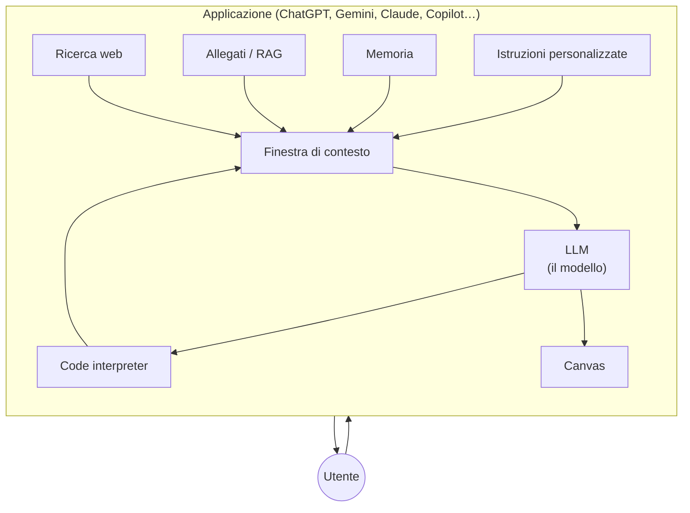

# M07 · Le funzionalità, cosa l'app aggiunge al modello

> ChatGPT è un coltellino svizzero con funzionalità nascoste dappertutto. E ogni chat le chiama con un nome diverso.

## Perché

Le funzionalità servono a superare i limiti intrinseci dell'LLM (cutoff, calcoli, memoria). Ma sono anche la parte che cambia più in fretta: nomi, pulsanti e limiti degli account gratuiti cambiano ogni mese. Per questo il modulo insegna **cosa fa** ogni funzionalità e **come riconoscere** se si è attivata, non dove cliccare.

## Il principio guida

Ogni funzionalità si colloca nello schema: è qualcosa che **l'applicazione** aggiunge intorno al **modello**. Il modello non sta imparando, non sta "cercando": è l'app che gli passa altro testo nella finestra di contesto o che esegue strumenti al posto suo.

## Mappa delle funzionalità

| Funzionalità | Cosa fa | Limite dell'LLM che compensa | Come capisco se si è attivata | Stabilità |
|---|---|---|---|---|
| Ricerca web | Cerca pagine e le usa per rispondere | Cutoff, allucinazioni sui fatti | Compaiono le fonti | evolutivo |
| Deep research | Ricerca agentica: piano modificabile, molte fonti, report lungo | Superficialità della ricerca standard | Piano di ricerca, tempi lunghi, citazioni | evolutivo |
| Allegati | Il testo del file entra nel contesto, intero o a pezzi (RAG) | Conoscenza dei tuoi documenti | Test inverso: "qual è la seconda parola di pagina 5?" | evolutivo |
| Dettatura e voce | Speech-to-text → LLM → text-to-speech: tre modelli in catena | Interazione solo scritta | Modalità conversazione | evolutivo |
| Ragionamento | Il modello genera token di "pensiero" prima di rispondere | Errori su problemi complessi | Tempo di attesa; ragionamento visibile in alcune chat | evolutivo |
| Canvas | Documento condiviso con la chat; ambiente di simulazione per pagine web e web app | Il testo che scorre in chat è scomodo da modificare | Pannello laterale; anteprima del codice | volatile |
| Code interpreter | Il modello scrive codice Python che viene eseguito davvero | Non sa fare i calcoli | Blocchi di codice visibili e apribili | evolutivo |
| Istruzioni personalizzate | Istruzioni che valgono per tutte le chat | Ripetere ogni volta chi sei e come vuoi le risposte | Impostazioni del profilo | volatile |
| Memoria | L'app salva informazioni su di te e le reinserisce nelle chat nuove | Ogni chat parte da zero | Avviso "memoria aggiornata"; pagina di gestione | volatile |
| Chat personalizzate | Una chat con istruzioni, file e strumenti fissi (GPT, Gem, "agenti" di Copilot) | Copia-incolla dello stesso prompt | Nome della chat in alto | volatile |
| Progetti | Contenitore in cui chat e file si vedono tra loro | Allegati e contesto da ripetere | Cartella progetto | volatile |

## Attività brevi

- **Ricerca web consapevole**: attivarla esplicitamente; aprire le fonti; il "doppio livello di opacità" (perché ha scelto quelle fonti, e come le ha usate). Esempio: cercare informazioni su una persona e trovare fonti di omonimi.
- **Deep research**: leggere e modificare il piano *prima* di lanciarla. Tema consigliato: "le potenzialità concrete dell'AI nel mio lavoro".
- **Ricerca accademica**: provare uno strumento dedicato (es. Consensus) e aprire gli abstract.
- **Confronto sugli allegati**: chiedere con ricerca web "quali allegati gestiscono ChatGPT, Claude e Gemini? Tabella" e confrontare con un'altra chat. Principio: per informazioni sullo strumento, usa la ricerca web, non la "conoscenza" del modello.
- **Voce cattivissima**: in modalità conversazione chiedere al modello di essere "cinico, critico e cattivissimo" con te. Fa ridere e mostra che il tono è un'istruzione.
- **Canvas in due tempi**: il CV di un personaggio inventato (documento collaborativo), poi "crea nel canvas il suo sito personale" (simulazione), poi una dashboard, poi una web app che genera codici QR. Scheda: [dal CV alla web app](#canvas-dal-cv-alla-web-app).
- **Code interpreter**: analisi statistica di un file Excel di esempio. Confrontare i risultati tra partecipanti: se divergono, il code interpreter forse non si è attivato.
- **Memoria**: aprire la pagina della memoria e leggere cosa ha salvato. Poi "ricorda che sono celiaco e mi piacciono le pere" e chiedere un menu.
- **Chat personalizzata**: un "creatore di corsi" o un "paroliere" (tre parole → testo di canzone).

Dal percorso uno a uno:

- **Modello multimodale, app che non lo è** (10 min): il video caricato nell'app aziendale viene rifiutato, lo stesso video in un'altra app viene letto. Il modello potrebbe, l'app non lo permette. Variante: si carica il video come file (non il link, che potrebbe essere letto da un altro sistema), si guarda il contatore dei token (decine di migliaia) e si verificano i minuti citati dalla risposta.
- **Lo stesso file, con e senza dati aziendali** (5 min): la stessa domanda su un documento interno con l'interruttore dei dati aziendali spento ("non ho accesso") e acceso.
- **Prova di scrittura** (3 min): "aggiungi in fondo al documento la frase *oggi è una bella giornata di sole*". La chat risponde che non può: le manca lo strumento. È il ponte verso gli agenti.
- **Esperimenti sui PDF** (15 min):
    - "cosa c'è nella riga 8 della tabella a pagina 11?": copiare il testo di un PDF fa perdere tabelle e pagine;
    - testo bianco su bianco, o carattere da 1 punto: se la chat lo legge, usa il testo nascosto nel file; se non lo legge, guarda la pagina come immagine. È anche la porta della prompt injection;
    - il modo in cui ogni app elabora gli allegati non è documentato: si scopre solo con i test, sul proprio caso.
- **Memoria e istruzioni, A/B** (15 min): "ricorda che lavoro come [il tuo ruolo]", poi la stessa domanda tecnica con la memoria accesa e spenta. Le istruzioni personalizzate entrano in ogni chat parola per parola; la memoria viene riformulata dal sistema e usata quando sembra pertinente. Poi si apre la pagina dei ricordi e si cancellano quelli spuri.
- **Il browser che legge la pagina** (5 min): la chat laterale del browser legge la pagina aperta. Per capire un limite d'uso si apre la documentazione ufficiale e la si interroga.
- **Il modello non sempre si sceglie**: nella chat c'è il selettore; dentro le app integrate (videoscrittura, presentazioni, intranet) spesso no.
- **Il canvas come documento** (10 min): titolo, modifica a mano, "seleziona e chiedi", condivisione con permessi, esportazione. "Fammi una prima bozza nel canvas" invece di iterare in chat.
- **Code interpreter, a fondo** (15 min): un ambiente isolato che esegue codice Python, di solito senza internet. Si attiva da solo o si chiede ("usa l'interprete di codice"). Si riconosce dal blocco di codice visibile. Caso d'uso: unire e analizzare più fogli di calcolo, poi una dashboard nel canvas. I numeri sono calcolati, ma il codice può essere sbagliato e la lettura dei dati pure: si controlla.
- **Trascrizioni e verbali** (10 min): la piattaforma di videochiamata registra e trascrive. La trascrizione distingue chi parla in base all'account, non alla voce. Il riepilogo automatico usa un formato fisso, che non sempre serve: vedi la scheda [Riepiloghi su misura](#riepiloghi-su-misura).

Dal percorso per la scuola:

- **Prima la ricerca, poi la demo** (45 min): ogni gruppo cerca e presenta uno strumento generativo (testo, immagini, audio, video) prima che lo mostri il docente: cosa fa, quanto costa, da che età si può usare.
- **La canzone della classe** (20 min): il testo scritto dalla classe diventa canzone con un generatore musicale. Si consegna il link. Attenzione all'età minima e all'account: di solito è meglio che lo generi il docente.

## Frasi che uso

- "La fiducia non esiste. La fiducia si costruisce." (Come con i motori di ricerca.)
- "I conti non fateli mai fare all'LLM. Chiedete sempre il code interpreter."
- "Tenete pulita la memoria: occupa spazio nella finestra di contesto, consuma token e contamina le risposte."
- "Questi strumenti li hanno costruiti altri e non sappiamo con quali logiche. Usateli criticamente, ma usateli."

## Punti critici

- **Volatilità estrema**: nomi, pulsanti, limiti gratuiti, disponibilità per paese ed età. Questo modulo va riverificato prima di ogni edizione. → [manutenzione](../manutenzione.md)
- **Terminologia commerciale**: Microsoft chiama "agenti" le chat personalizzate. In aula lo dico, e rimando la definizione vera di agente a [M10](10-agenti.md).
- **Esercizi su personaggi inventati**: divertono, ma alcuni partecipanti li trovano lontani dal loro lavoro. Vedi la proposta PBL in [fondamenta](../fondamenta.md).
- **Siti imitazione**: nelle ricerche compaiono siti sponsorizzati che imitano le chatbot ufficiali. Controllare sempre il dominio.

## Risorse per approfondire

Panoramica degli strumenti per categoria, così come la presento in aula. È **volatile**: va riverificata prima di ogni corso.

| Categoria | Esempi |
|---|---|
| Canzoni | Suno (testo e musica), AIVA |
| Immagini | il modello di immagini di Gemini, Leonardo |
| Video | Veo |
| Codice e web app | Canvas di ChatGPT e Gemini, Lovable, Replit |
| Agenti | Manus, Codex, Claude Code, Antigravity, assistenti open source |
| Documenti | NotebookLM, chatbot con progetti e cartelle |
| Browser con AI | Gemini in Chrome, Edge, Dia, Comet, Atlas, Genspark |
| Chat personalizzate | "scrittore di poesie", "convertitore Markdown", "analista critico" |

Esempi di web app costruite così: [Emoji Sudoku](https://www.monaripietro.it/sudoku/), [Simulatore di rete neurale](https://www.monaripietro.it/retineurali/).

## Schede attività

### Dal CV alla web app { #canvas-dal-cv-alla-web-app }

**Durata:** 45–60 minuti · **Gruppo:** individuale · **Materiali:** una chatbot con canvas · **Schermi:** sì

**In una frase:** dallo stesso personaggio inventato si passa da un documento a un sito, a una dashboard, a una piccola applicazione.

#### Passaggi
1. **Documento collaborativo.** "Scrivi nel canvas il CV Europass di Mario (o Maria) Rossi: [inventa tu, più è strano meglio è]. Inventa i dati che mancano." Poi si modifica: selezionando una parte, chiedendo alla chat, a mano.
2. **Simulazione: il sito.** "Crea nel canvas il sito web personale usando le informazioni del CV." Si guarda l'anteprima. Si chiedono modifiche.
3. **La dashboard.** "Crea nel canvas una dashboard con le statistiche dei visitatori del sito."
4. **La web app.** In una chat nuova: "Crea nel canvas una web app che genera un codice QR a partire da un URL inserito dall'utente." Poi si prova con il telefono.

#### Debriefing
- Cosa è un documento e cosa è una simulazione? (Il canvas gestisce testo, ma anche HTML, CSS, JavaScript.)
- Cosa serve per mettere il sito online davvero? Chiedere una guida passo passo è utile, ma se la guida fa eseguire comandi che non capisci, fermati.
- Cosa vuol dire per il lavoro di chi sviluppa software che chiunque possa fare una web app in cinque minuti?
- Perché gli slider "più lungo / più formale" sono poco utili? Perché sei tu che devi sapere cosa vuoi.

#### Cosa può andare storto
- L'anteprima non si apre: chiederla esplicitamente, oppure copiare il codice in una chat nuova.
- Con gli account gratuiti il modello è più debole e il codice può non funzionare: per il codice servono modelli che ragionano.
- **Limite didattico**: il personaggio inventato diverte ma è lontano dal lavoro reale. Variante PBL: fare lo stesso percorso sul proprio progetto.

#### Cosa ho visto succedere
Dal CV di un personaggio che parlava "serpentese" il modello ha creato un sito con un sintetizzatore di suoni sibilanti e un simulatore di videogiochi anni '80. Nessuno se lo aspettava, me compreso: è il momento in cui la classe capisce che il modello va oltre la richiesta letterale.

> **Da rivedere.** Scheda ricostruita da una mia lavagna Miro: va controllata e completata.

### Mappa delle funzionalità a tre livelli { #mappa-funzionalita }

**Durata:** 45–60 minuti · **Gruppo:** gruppi, poi plenaria · **Materiali:** lavagna condivisa, documento condiviso · **Schermi:** sì

**In una frase:** le funzionalità di una chatbot, divise per livello di competenza, ognuna con un micro-test da fare subito.

#### Passaggi

1. **La mappa.** Tre livelli:
   - **di base:** ricerca web, allegati, canvas, condivisione, immagini, apprendimento guidato, input vocale, conversazione vocale;
   - **intermedio:** progetti e cartelle, attività programmate, deep research, simulazioni nel canvas, istruzioni personalizzate, memoria;
   - **avanzato:** scelta del modello, code interpreter, chat personalizzate, agenti, connettori (MCP).
2. **I micro-test**, uno per funzionalità. Esempi:
   - ricerca web: "chi è il Papa attuale?", con e senza ricerca, per vedere il cut-off;
   - memoria: "ricordati che mi piace la mela", poi in una chat nuova "dammi la ricetta di un dolce";
   - deep research: "crea una ricerca approfondita su MCP";
   - canvas: "scriviamo una poesia".
3. **Il documento comune.** "Per ogni funzionalità scrivi una descrizione breve in un documento da modificare insieme."
4. **Confronto tra app.** Si segna quali funzionalità esistono anche in un'altra chatbot (Gemini, Claude, Le Chat, Copilot) e quali sono esclusive. Su Gemini, per esempio: Gem, audio overview, quiz e pagina web dopo una deep research.

#### Note

- La mappa è **volatile**: nomi e collocazione delle funzioni cambiano ogni pochi mesi. Va riverificata prima di ogni corso, con le pagine di aiuto ufficiali.

> **Da rivedere.** Scheda ricostruita da un corso 1:1: va controllata e completata.

### Riepiloghi su misura { #riepiloghi-su-misura }

**Durata:** 30 minuti · **Gruppo:** individuale o coppie · **Materiali:** la trascrizione di una riunione o di una lezione · **Schermi:** sì

**In una frase:** il riepilogo automatico di una riunione ha un formato fisso; costruisci una chat personalizzata con il formato che serve a te.

#### Perché la faccio

Il riepilogo automatico chiede sempre "che decisioni avete preso?". Ma se era una lezione? Il formato decide cosa si salva e cosa si perde. Ed è un primo passo concreto verso le chat personalizzate.

#### Passaggi

1. **Confronta (5 min).** Si guarda il riepilogo automatico di una lezione e si cerca cosa manca.
2. **Progetta (10 min).** Due schemi di output:
   - **riunione:** obiettivo, punti discussi, decisioni, azioni con responsabile e scadenza, questioni aperte;
   - **lezione:** titolo, idea centrale, concetti chiave, definizioni, schema logico, esempi, errori comuni, mini-ripasso.
3. **Costruisci (10 min).** Una chat personalizzata con le istruzioni e i due schemi. Input: la trascrizione.
4. **Prova (5 min).** Si usa sulla lezione appena fatta.

#### Debriefing

- Chi decideva cosa salvare, prima?
- Quale altra attività ripeti due o tre volte a settimana con lo stesso formato?

#### Cosa può andare storto

- Riservatezza: prima di registrare e trascrivere, chiarire le regole dell'organizzazione e avvisare i presenti.

## Schemi

### L'app intorno al modello { #schema-app-intorno-al-modello }

Le funzionalità non stanno nel modello: le aggiunge l'applicazione.

**Da ricordare:** quasi tutte le funzionalità funzionano mettendo altro testo nella finestra di contesto, o eseguendo strumenti al posto del modello.
