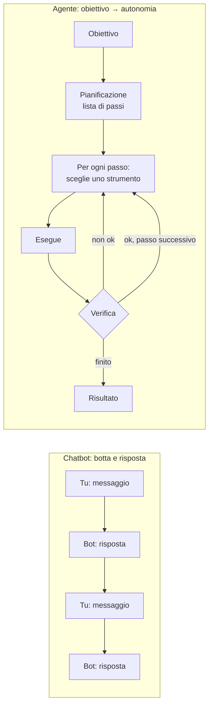

# M10 · Agenti, dall'aiuto all'autonomia

> La chatbot è conversazionale: botta e risposta. Con l'agente non c'è botta e risposta. Gli dai un obiettivo e lui lo fa.

## Perché

"Agente" è la parola più abusata del 2026. Microsoft chiama "agenti" delle chat personalizzate. Molti partecipanti arrivano già con progetti di agenti, a volte molto avanzati, a volte costosissimi. Serve una definizione operativa e un criterio per capire quando un agente ha senso.

## Obiettivi

- Distinguere chatbot, chat personalizzata e agente.
- Nominare gli elementi di un agente: obiettivo, pianificazione, strumenti, memoria, autonomia.
- Riconoscere comportamenti agentici già presenti nelle chat (la deep research).
- Capire perché i fondamenti (finestra di contesto, token, modello vs app) diventano critici con gli agenti.

## Concetti chiave

| Concetto | Come lo dico | Stabilità |
|---|---|---|
| Agente | Un sistema che, dato un obiettivo, pianifica, sceglie gli strumenti, esegue passo passo, verifica e arriva in fondo senza chiederti niente | evolutivo |
| Pianificazione | "Devi riordinare i documenti del computer." Uno: trova i file. Due: segna le cartelle. Tre: ordina. L'agente si scrive la lista e la spunta | evolutivo |
| Strumenti (tool) | L'LLM gestisce il linguaggio, gli strumenti fanno le cose: ricerca web, esecuzione di codice, accesso ai file, browser, calendario. Li scegli tu quando costruisci l'agente | evolutivo |
| Livelli di autonomia | Dal chiedere conferma a ogni passo al fare tutto da solo, anche con la tua carta di credito | evolutivo |
| Chat personalizzata ≠ agente | Non pianifica, ha due o tre strumenti, aspetta sempre te | stabile |
| La parola "agente" | È una parola degli anni '70 dell'AI: in senso tecnico, quasi tutti i sistemi sono agenti. Il significato commerciale di oggi è più stretto | stabile |
| Costi | Negli agenti si paga a token, niente tariffe flat. Un agente che lavora molto può costare molto | volatile |

## Come lo conduco (introduzione)

1. **Ripartire dalla deep research** (10 min): piano, ricerca autonoma, report. È già un comportamento agentico.
2. **La definizione** (15 min), con lo schema in [schema: agente](#schema-agente).
3. **Una demo dal vivo** (20 min). Nel 2026 ho mostrato un agente personale su telefono che archivia articoli a partire da un link e crea file sul dispositivo, e un browser agentico che legge tutte le pagine di un sito e le salva in un documento. La demo può fallire. Quando fallisce, lo dico, ed è parte della lezione.
4. **Discussione sui progetti dei partecipanti** (15 min). Chi sta costruendo agenti racconta l'architettura. Si ragiona su flussi, criticità, costi, e su cosa succede alla finestra di contesto.

## Frasi che uso

- "Il limite oggi è la nostra capacità di definire bene cosa vogliamo."
- "Prima diventate bravi con le chat e le funzionalità. Gli agenti, oggi, non sono facili da usare in modo economico."
- "Quando costruite un agente, l'LLM è il cervello che gestisce il linguaggio. Tutto il resto glielo dovete costruire intorno voi."

## Attività brevi

- **Deep research come primo agente** (20 min): una deep research usata per una ricerca operativa (cosa devo fare), non per un report. Si legge il piano, si corregge, si osservano i passaggi.
- **Una web app fatta da un agente** (30 min): stessa richiesta a un agente generalista e a uno strumento di sviluppo. Esempio: una web app per stimare i tempi dei task e organizzare la giornata di lavoro.

Dal percorso uno a uno:

- **Com'è fatto un agente** (15 min): al centro un LLM; intorno pianificazione, memoria, strumenti e autonomia, in un ciclo che si ripete finché il compito è finito. La chat ha quasi tutto, tranne l'autonomia. Due conseguenze: l'agente eredita i limiti dell'LLM (un'allucinazione nel piano lo porta fuori strada e brucia token) e le istruzioni degli strumenti occupano la finestra di contesto.
- **Il riordino della cartella** (10 min, racconto o demo): un agente sul computer trova i file grandi e i doppioni, propone una struttura di cartelle, sposta. Risultato: ordine, ma "non so più dove sono i miei file". Chi li ritrova? L'agente. La chat diventa l'interfaccia per tutto.
- **La scala** (10 min): chat → chat personalizzata (istruzioni + documenti) → automazione (si attiva da sola e salva in una cartella) → agente che lavora su quella cartella. Criterio: ha senso salire quando un'attività si ripete due o tre volte a settimana con regole chiare.
- **"Agente", parola commerciale**: in molte suite si chiama agente quella che è una chat personalizzata.
- **Valutare un fornitore** (10 min, per chi decide): chiedere l'accuratezza misurata su un numero noto di documenti, non una demo. Confrontare con il costo di farlo in casa.

## Punti critici

- **Modulo da sviluppare**: finora gli agenti sono stati l'oggetto di un corso successivo. Questa scheda è un'introduzione. Va scritto il percorso completo (strumenti, flussi, valutazione, sicurezza, costi).
- **Sicurezza**: guide passo passo che fanno eseguire comandi sul terminale, agenti con accesso a file e carte di credito. Serve una sezione dedicata ai rischi (prompt injection, permessi, dati).
- **Lavoro**: i confronti tra costo di un agente e costo di una persona sono emersi in aula. Vanno trattati con cura e con dati, non a battute.
- **Volatilità**: nomi di prodotti agentici (assistenti di programmazione, browser agentici, piattaforme di automazione) cambiano ogni pochi mesi.

- **Sicurezza, prima di dare accesso ai file a un agente**: backup, ambiente di prova, validazione delle azioni. Limitare le fonti ("solo origini specifiche"), togliere le capacità che non servono.

## Schemi

### Chatbot vs agente { #schema-agente }

Gli strumenti (ricerca web, codice, file, browser, calendario…) li decide chi costruisce l'agente. L'LLM è il cervello che gestisce il linguaggio e sceglie.
